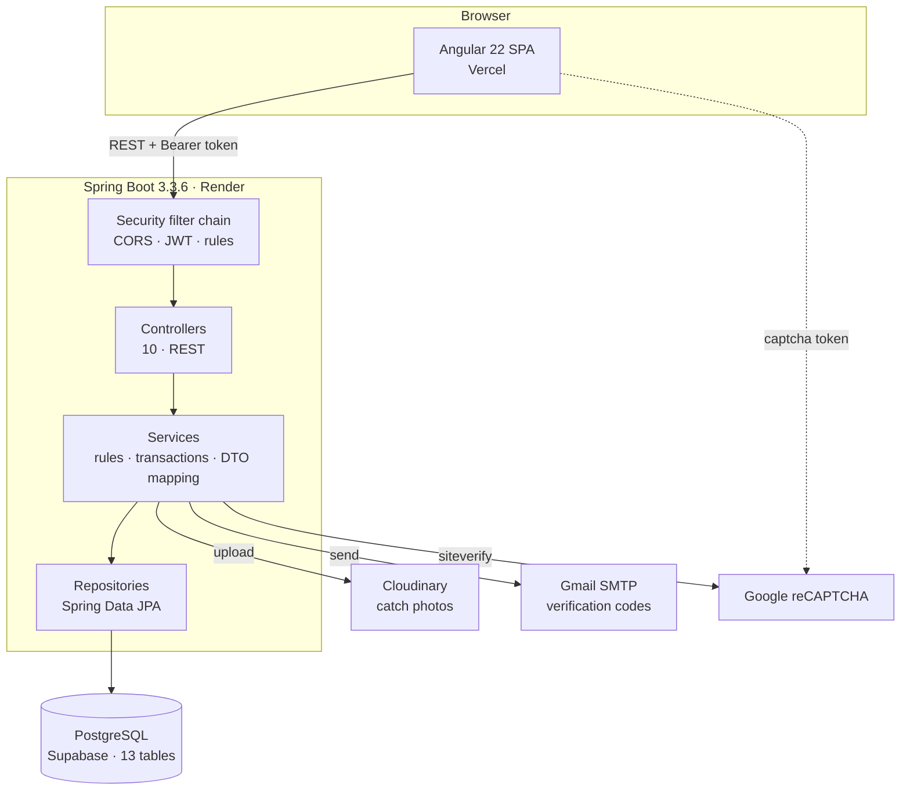
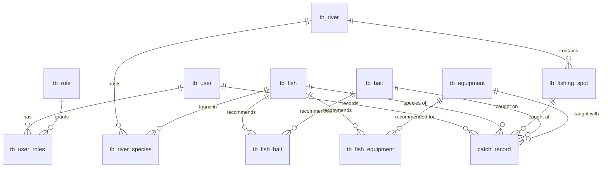
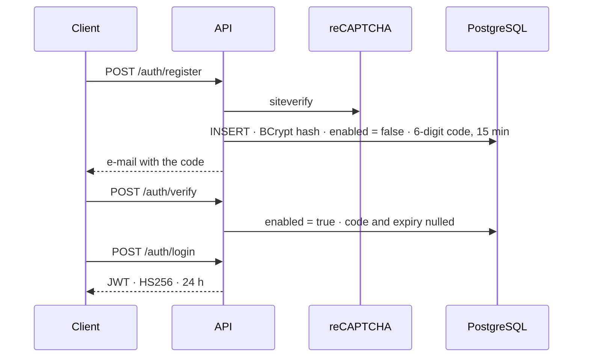

# Pesca Brasil — API

> The REST API behind Pesca Brasil.
> **[Frontend repository → pesca-brasil-ui](https://github.com/patrickpriebe/pesca-brasil-ui)**

A logbook for Brazilian sport fishing: a fisher records what they caught, where they
caught it, on what bait, under what moon — and the record joins a public map, a
species catalogue and three leaderboards.

**Live app: https://pesca-brasil-ui.vercel.app** · **API: https://pesca-brasil-api.onrender.com**

The project rests on a single decision: **a fishing spot does not have to exist before
you fish there.** Every other system of this kind asks you to pick a location from a
list somebody curated. This one takes the pin you dropped on the map, invents the spot
from it, and writes both rows in the same transaction. Everything below exists to
support that premise honestly — including the parts where it costs something.

---

## Table of contents

- [What it does](#what-it-does)
- [Product tour](#product-tour)
- [Architecture](#architecture)
- [Tech stack](#tech-stack)
- [The decision the project rests on](#the-decision-the-project-rests-on)
- [Data model](#data-model)
- [API surface](#api-surface)
- [Identity and security](#identity-and-security)
- [What is public, and why](#what-is-public-and-why)
- [Running locally](#running-locally)
- [Deployment](#deployment)
- [Testing](#testing)
- [Engineering decisions worth reading](#engineering-decisions-worth-reading)
- [Known limits](#known-limits)
- [Documentation](#documentation)

---

## What it does

| Flow | What happens |
|---|---|
| Browse | Species catalogue, rivers, baits, rods and closed seasons — no account needed |
| Sign up | E-mail and password, guarded by reCAPTCHA. A six-digit code arrives by e-mail |
| Verify | The account exists but cannot log in until the code is entered |
| Log a catch | Drop a pin on the map, pick the species, add weight, length, weather, moon phase |
| Photograph it | The image goes to Cloudinary first; the record carries the URL |
| Compete | Three public leaderboards: longest fish, heaviest fish, most active fisher |
| Check the law | *Piracema* — the annual spawning ban — by hydrographic basin |

Ten controllers, thirty-eight endpoints, thirteen tables, one PostgreSQL database, one
deployable JAR.

---

## Product tour

Screenshots come from the [frontend repository](https://github.com/patrickpriebe/pesca-brasil-ui);
every screen below is served by the endpoints documented here.

| | |
|---|---|
|  |  |
| **The map.** Every pin is a `tb_fishing_spot` row, and most of them were created by a catch record rather than registered in advance. | **Registering a catch.** The coordinates in this form are not a lookup key — they are the spot, and the API creates it. |
|  |  |
| **The catalogue.** Public, unauthenticated, paged and searchable — `GET /api/fishes?name=dourado`. | **The logbook.** A shared feed rather than a private journal; the response carries the fisher's display name and nothing else about them. |

---

## Architecture



One process, one database. No broker, no eventual consistency, no service discovery —
and that is a decision rather than a gap. The domain has exactly one aggregate that
anybody writes to often, and it needs the fish, the river and the spot to be consistent
at the moment it is written. A single transaction gives that for free; a distributed
architecture would charge for it.

| Layer | Responsibility | Never does |
|---|---|---|
| **Controller** | Bind HTTP, build the `Pageable`, choose the status code | Business rules, entity access |
| **Service** | Rules, cross-entity validation, transactions, entity ⇄ DTO | Know what HTTP is |
| **Repository** | Spring Data queries and projections | Anything else |
| **Entity** | The persistent model | Leave the service layer |

**An entity is never returned from a controller.** Not as ceremony — `User` carries a
BCrypt hash and a live verification code, `CatchRecord`'s associations are all `LAZY`,
and `Fish` points at a cycle Jackson would happily follow. The DTO makes all three
impossible rather than merely not-currently-happening.

Full reasoning: [docs/01-architecture.md](docs/01-architecture.md).

---

## Tech stack

| Layer | Choice | Notes |
|---|---|---|
| Language | **Java 21** | |
| Framework | **Spring Boot 3.3.6** | Web, Data JPA, Security, Validation, Mail |
| Database | **PostgreSQL** | Supabase, reached through the session pooler |
| Persistence | **Spring Data JPA / Hibernate** | Schema owned by `ddl-auto=update` — see [Known limits](#known-limits) |
| Auth | **Spring Security** + **JJWT 0.11.5** | Stateless, HS256, homegrown registration |
| Passwords | **BCrypt** | Spring Security's encoder, default strength |
| Validation | **Bean Validation** | Declarative, with a `@RestControllerAdvice` |
| Media | **Cloudinary** (`cloudinary-http44` 1.36.0) | Catch photos |
| E-mail | **Spring Mail** over Gmail SMTP | Six-digit verification codes |
| Bot defence | **Google reCAPTCHA** | Register and login |
| Docs | **springdoc-openapi 2.6.0** | On the classpath — see [Known limits](#known-limits) |
| Boilerplate | **Lombok** | Getters, setters, id-only equality |
| Container | **Docker**, two-stage | Maven build stage, Temurin 21 runtime |
| Frontend | **Angular 22** + Tailwind 4 + Leaflet | Separate repository |

---

## The decision the project rests on

Every logbook app of this kind has the same screen: *choose your fishing spot from the
list.* It is a sensible screen and it is wrong for this domain, because the list is
always missing the place you actually fished. A river has thousands of metres of bank
and a rock somebody likes; a curated list has forty entries.

So `POST /api/catch-records` accepts **coordinates instead of a spot id**:

```json
{
  "fishId": 3,
  "riverId": 7,
  "latitude": -25.5163,
  "longitude": -54.5854,
  "spotName": "Remanso da ponte",
  "catchDate": "2026-08-24T06:30:00"
}
```

and the service creates the spot as it writes the record:

```
POST /api/catch-records ─┬─ resolve the user from the SecurityContext
                         ├─ resolve the fish            (rejected if absent)
                         ├─ INSERT tb_fishing_spot      ← the pin becomes a place
                         ├─ resolve bait and equipment  (both optional)
                         └─ INSERT catch_record         ← points at the new spot
                            ─────────────────────────
                            one transaction · both rows or neither
```

The shared transaction is the part that matters. If the record insert fails, the spot
it invented rolls back with it — otherwise the table would slowly fill with coordinates
nobody ever logged a catch at.

The endpoint still accepts a `fishingSpotId` for the curated case. Which branch runs is
decided by whether that field is null, and the two are mutually exclusive.

**What the decision costs**, stated plainly rather than left for someone to discover:

- Two catches from the same rock create two spots. The table grows once per catch, not
  once per place. Radius-based deduplication is the fix, and it is
  [on the roadmap](docs/06-roadmap.md#16--deduplicate-fishing-spots).
- A spot born from a pin carries `accessType = "Não especificado"` and a generated name
  — `"Ponto no <river>"` when the fisher did not supply one — and is otherwise
  indistinguishable from a curated one.
- Bean validation marks `riverId`, `latitude` and `longitude` as required, so the
  curated branch must still send fields it will ignore. That needs cross-field
  validation.

The decision is still right. Asking a fisher to file the location before recording the
fish is asking them not to record the fish.

---

## Data model

Thirteen tables. Reference data, geography, identity, and one table anybody writes to.



| Group | Tables |
|---|---|
| **Identity** | `tb_user`, `tb_role`, `tb_user_roles` |
| **Catalogue** | `tb_fish`, `tb_bait`, `tb_equipment`, `tb_fish_bait`, `tb_fish_equipment` |
| **Geography** | `tb_river`, `tb_fishing_spot`, `tb_river_species` |
| **Regulation** | `tb_fishing_regulation` |
| **The logbook** | `catch_record` |

Three modelling notes worth pulling out:

**Nullability is the model's opinion about the domain.** On `catch_record`, only
`user_id`, `fish_id`, `fishing_spot_id` and `catch_date` are required — *what, where,
who, when.* Bait, rod, weight, length, weather, moon and photo are all optional,
because people fish without writing everything down, and a schema that demanded all of
it would produce either lies or abandoned forms. Weight and length being independently
optional is exactly what makes the two leaderboards separate queries.

**`tb_river_species` is an entity, not a join table.** "Dourado is `ALTA` abundance in
the Rio Paraná, best between September and November" is a fact about the *pairing*. It
has nowhere to live on either side alone.

**Regulations point at a basin by name, not at a river by id.** The closed season is
published per basin and a basin holds many rivers; a foreign key would duplicate the
regulation per river and go stale whenever one was added. The cost is two free-text
columns that agree by convention rather than by constraint.

Every enum is `@Enumerated(EnumType.STRING)`. Ordinal storage silently reinterprets
every historical row the moment somebody inserts a value in the middle of the enum.

Full detail: [docs/02-data-model.md](docs/02-data-model.md).

---

## API surface

Base path `/api`. Every collection is paged (`page`, `size`, `sortBy`). Every `GET` is
public; 🔒 marks what needs a bearer token.

| Resource | Endpoints |
|---|---|
| **Auth** | `POST /auth/register` · `/auth/verify` · `/auth/login` · `/auth/forgot-password` · `/auth/reset-password` |
| **Catch records** | `GET /catch-records` · `POST` 🔒 · `DELETE /{id}` 🔒 |
| **Rankings** | `GET /catch-records/ranking/comprimento` · `/peso` · `/pescadores` |
| **Fish** | `GET /fishes` `?name=` · `GET /{id}` · `POST` 🔒 · `DELETE /{id}` 🔒 |
| **Baits** | `GET /baits` `?name=` · `POST` 🔒 · `DELETE /{id}` 🔒 |
| **Equipment** | `GET /equipments` · `POST` 🔒 · `DELETE /{id}` 🔒 |
| **Rivers** | `GET /rivers` `?name=` · `GET /{id}` · `POST` 🔒 · `DELETE /{id}` 🔒 |
| **River species** | `GET /river-species` · `GET /river/{riverId}` · `POST` 🔒 · `DELETE /{id}` 🔒 |
| **Fishing spots** | `GET /fishing-spots` · `GET /river/{riverId}` · `GET /{id}` · `POST` 🔒 · `DELETE /{id}` 🔒 |
| **Regulations** | `GET /fishing-regulations` `?basin=` · `POST` 🔒 · `DELETE /{id}` 🔒 |
| **Images** | `POST /images/upload` — `multipart/form-data`, field `file` |

Errors carry a consistent envelope, built by `GlobalExceptionHandler`:

```json
{
  "timestamp": "2026-08-27T14:03:11.204",
  "status": 400,
  "error": "Erro de Validação",
  "message": "O peixe é obrigatório.",
  "path": "/api/catch-records"
}
```

Error messages are in Portuguese, because they are written to be shown to a Brazilian
end user and the frontend displays them directly. Identifiers, table names, code and
this documentation are in English.

Endpoint-by-endpoint reference, with payloads:
[docs/03-api-reference.md](docs/03-api-reference.md).

---

## Identity and security

Authentication is written from scratch — no Firebase, no Auth0, no OAuth provider. The
audience is Brazilian recreational fishers, a good share of whom would rather not
attach a Google account to a hobby app, and the product needs exactly one thing from
identity: *this e-mail address belongs to the person using it.* An e-mail round trip
proves that directly.



Three properties carry the design:

**The account exists before it is usable.** `enabled` is `false` on insert and
`CustomUserDetailsService` passes it into the `UserDetails` it builds, so Spring
Security's own provider refuses the login. The check is a field the framework already
respects, not an `if` somebody can forget to write.

**The code is destroyed when used.** Both `verification_code` and its expiry are nulled
on success, so a verified row holds no live secret and a database read cannot yield a
working credential. Expiry is checked *before* correctness — an expired code is refused
as expired regardless of whether it was right.

**The token carries no roles, on purpose.** Three claims: subject, issued-at, expiry.
`JwtAuthenticationFilter` loads the user from PostgreSQL on every authenticated
request, which costs one indexed read and buys three things a self-contained token
cannot give: disabling an account takes effect on the *next request* rather than in up
to 24 hours, a role change takes effect immediately, and deleting a user invalidates
every token they hold at once.

That trade is the deliberate counterweight to a token that cannot be revoked. There is
no denylist and no server-side session; logging out means the client discards the
token. Twenty-four hours is the entire blast radius of a leak, and that number is the
thing to argue about — not the mechanism.

reCAPTCHA guards register and login, and **fails closed**: a network error, a malformed
response or a missing secret all refuse the request. Failing open would silently remove
the only bot defence on the account endpoints, and a registration form is exactly where
that matters.

Sessions are `STATELESS` and CSRF is disabled — the correct pairing, because with no
session cookie there is no ambient credential for a cross-site request to ride on.

No secret is in this repository. `application.properties` holds only the shape
(`${DB_URL:}`, `${CLOUDINARY_API_SECRET:}`, …); real values live in Render's
environment panel, and `application-local.properties` is git-ignored and has never
appeared in the history.

Full detail, including what is not done: [docs/04-security.md](docs/04-security.md).

---

## What is public, and why

Four rules, in order:

| # | Matcher | Effect |
|---|---|---|
| 1 | `/api/auth/**` | Public — registration cannot require a token |
| 2 | `/api/images/**` | Public |
| 3 | `GET /api/**` | Public |
| 4 | everything else | Authenticated |

Rule 3 is a product decision expressed as configuration: **the catalogue and the
logbook are public.** Anyone can read the species, the rivers, the closed seasons, the
leaderboards and every catch record without an account. That is what the product is — a
public record of Brazilian sport fishing — and putting a login in front of it would
cost exactly the audience it is meant to reach.

It is also why `CatchRecordResponseDTO` carries `userName` and no other identifying
field. The records are public, so the response was designed for a public reader from
the start rather than trimmed later.

---

## Running locally

JDK 21 and a PostgreSQL database. There is no `docker-compose.yml` yet — see
[Known limits](#known-limits).

```bash
git clone https://github.com/patrickpriebe/pesca-brasil-api.git
cd pesca-brasil-api
```

Create `src/main/resources/application-local.properties` — the path is git-ignored:

```properties
spring.datasource.url=jdbc:postgresql://localhost:5432/pescabrasil
spring.datasource.username=postgres
spring.datasource.password=postgres

cloudinary.cloud-name=your-cloud
cloudinary.api-key=your-key
cloudinary.api-secret=your-secret

spring.mail.username=you@gmail.com
spring.mail.password=your-app-password

google.recaptcha.secret=your-recaptcha-secret
jwt.secret=a-secret-of-at-least-32-characters-for-HS256
```

```bash
./mvnw spring-boot:run
```

Port **8080**. `spring.profiles.active=local` is already set, so the file is picked up
without a flag. Hibernate creates the schema on first boot and `RoleDataLoader` seeds
the two roles idempotently.

```bash
curl "http://localhost:8080/api/fishes?size=5"
```

| To exercise | You need |
|---|---|
| Any read | PostgreSQL only |
| Register and log in | reCAPTCHA secret **and** SMTP credentials |
| Photo upload | Cloudinary credentials |
| Anything authenticated | `jwt.secret`, at least 32 characters |

Registration is the awkward one locally: without a working reCAPTCHA secret the
endpoint refuses everything, because the service fails closed. Google's documented test
keys are the usual way through.

### Docker

```bash
docker build -t pesca-brasil-api .
docker run -p 8080:8080 --env-file .env pesca-brasil-api
```

Two-stage: Maven compiles in the build stage, only the JAR crosses into the Temurin 21
runtime.

Full environment-variable table and the constraints behind the deployment:
[docs/05-deployment.md](docs/05-deployment.md).

---

## Deployment

| Piece | Provider | Notes |
|---|---|---|
| API | **Render** | Docker runtime, free instance |
| Database | **Supabase** | PostgreSQL, session pooler on 6543 |
| Images | **Cloudinary** | |
| E-mail | **Gmail SMTP** | App password |
| Frontend | **Vercel** | Angular 22 |
| Frontend errors | **Sentry** | `@sentry/angular`, in the UI repository |

Three constraints only show up after actually deploying, and they are worth stating:

**Free Render instances sleep.** After idle traffic the container spins down and the
next request pays a full cold start — JVM boot, Hibernate schema reconciliation,
connection pool. First-request latency of a minute or more is normal, and it is why the
deployed API can look down when it is merely asleep. There is no scheduled ping in this
repository.

**`prepareThreshold=0` in the JDBC URL is not optional.** Supabase's transaction pooler
hands out a different backend session per transaction, and a server-side prepared
statement lives in a session. Without that parameter, queries fail intermittently with
*"prepared statement already exists"* under any real concurrency.

**Sentry is in the frontend, not here.** This API has no Sentry SDK, no Actuator and no
metrics endpoint; a server-side exception appears in Render's log stream and nowhere
else. It is called out because it is easy to read the frontend's monitoring as the
whole system's.

---

## Testing

**One test.** `BrazilApplicationTests.contextLoads` starts the Spring context and
asserts that it starts.

Worth being exact about rather than dressing up. It does catch a real class of failure
— a missing bean, a circular dependency, a `@Value` with no property behind it, an
entity Hibernate cannot map — and those are precisely the errors that only appear at
boot. It catches no behaviour at all: not a validation rule, not the ownership logic,
not the token filter, not the spot-creation branch. It also needs a reachable database,
which is why the Docker build skips it and why there is no CI pipeline yet.

The intended shape, in the order it should be written, is in
[docs/05-deployment.md](docs/05-deployment.md#testing). The most valuable first test is
the JWT contract, because that is the only place where a silent regression is an
authentication bypass rather than a broken screen.

---

## Engineering decisions worth reading

A few choices that are easy to get wrong and were deliberate here.

**Identity is derived from the token, never read from the payload.**
`CatchRecordRequestDTO` has no user field at all. The owner comes from the
`SecurityContext`, so a client cannot post a record as somebody else — not because a
check rejects it, but because there is nowhere to put the lie.

**Read-only by default, writable by exception.** Every service class is
`@Transactional(readOnly = true)` and every mutating method overrides it. Hibernate
skips dirty checking on reads, and a method that forgets the override fails loudly at
the first write instead of quietly committing.

**Expiry before correctness.** `verifyAccount` checks the timestamp before the code. An
expired code is refused as expired regardless of whether it was right — the alternative
tells an attacker holding an old code that the code was at least valid.

**E-mail is `@Async` so SMTP is not inside a transaction.** Sending synchronously inside
`registerUser` would put a five-second timeout inside a transaction that has already
inserted the user. The trade is that a send failure is invisible to the caller, which
is why *forgot password* doubles as the recovery path. *(The annotation is present;
`@EnableAsync` is not yet — see [Known limits](#known-limits).)*

**Mapping is hand-written, not reflective.** A private `convertToResponseDTO` per
service. For eight small aggregates, MapStruct or ModelMapper costs a dependency, a
build step and a class of bugs that only appear when a field is renamed; the
hand-written method fails to compile instead. That trade stops holding somewhere north
of twenty aggregates, and the duplication is the price until then.

**Id-only equality on entities.** `@EqualsAndHashCode(onlyExplicitlyIncluded = true)`
with only the id. Lombok's default would include every field, so an object's hash code
would change while it sat in a `Set`, and comparing two entities would load their lazy
associations just to do it.

**Enums as strings, everywhere.** Ordinal storage writes `0`, `1`, `2` and silently
reinterprets every historical row the first time somebody inserts a value in the middle
of an enum. Three bytes is a cheap defence against that.

**Upload first, then post the record.** The client sends the photo to
`/api/images/upload`, gets a URL back, and includes it in the catch record. Splitting
the two means a slow upload does not hold a database transaction open, and a failed
upload does not lose the rest of the form.

---

## Known limits

Recorded so they do not read as oversights. Everything here has an entry in
[docs/06-roadmap.md](docs/06-roadmap.md).

- **Roles are defined but not enforced on the server.** `ROLE_ADMIN` and
  `ROLE_PESCADOR` are seeded, assigned, loaded as authorities and returned on login —
  and no endpoint checks them. There is no `@PreAuthorize` anywhere; the only
  distinction the API makes is authenticated versus not, so the admin boundary
  currently exists only in what the frontend chooses to render. Method security on the
  catalogue writes is the first item on the roadmap.
- **Catch-record deletion is authenticated but not owner-checked.** The write path takes
  the owner from the token; the delete path does not compare it.
- **`jwt.secret` has a committed fallback.** It exists so a fresh clone boots, and the
  consequence is that an environment missing `JWT_SECRET` also boots — signing with a
  value published in this repository. A secret should have no default, for the same
  reason `DB_URL` has none.
- **The image endpoint is unauthenticated and unbounded.** No token, no size limit, no
  content-type allowlist, writing into the project's Cloudinary account.
- **Nothing is rate limited.** Login, registration and password reset can each be
  automated against as fast as the network allows, and the free tiers behind them —
  SMTP quota, Cloudinary storage, database connections — are what break first.
- **`forgot-password` has no captcha and confirms whether an account exists.** That is
  e-mail enumeration, cheaply. It should answer *"if an account exists, a code has been
  sent"* either way.
- **The OTP comes from `java.util.Random`**, where `SecureRandom` belongs.
- **The schema is owned by `ddl-auto=update`.** It never drops, never alters, leaves no
  record of what ran, and gives the application permission to reshape production at
  boot. Flyway plus `validate` is the fix, and it blocks two other items: renaming
  `catch_record` to match its twelve `tb_*` siblings, and moving `catch_date` from
  `LocalDateTime` to a zoned type.
- **Every `RuntimeException` becomes a `404`.** `GlobalExceptionHandler` maps the common
  case — a referenced id that does not exist — and therefore also reports a genuine
  server fault as *not found*. The auth endpoints are unaffected; they catch and return
  `400` themselves.
- **Swagger is on the classpath and unreachable.** `springdoc-openapi` publishes
  `/v3/api-docs` and `/swagger-ui/**`, and neither is permitted by the filter chain, so
  the explorer cannot load its own document without a token it has no way to obtain.
- **`@EnableAsync` is missing**, so `EmailService`'s `@Async` methods currently run on
  the request thread.
- **Local development shares the deployed database.** A `docker-compose.yml` with a
  local PostgreSQL is the fix.
- **There is no CI pipeline**, and the Docker build runs with `-DskipTests`.
- **CORS allows `pescabrasil.vercel.app`; the deployed frontend is at
  `pesca-brasil-ui.vercel.app`.** Worth checking against the Vercel project's current
  domains.
- **Closed seasons are stored and not enforced.** A catch record dated inside a
  *piracema* period is accepted silently — and deciding what should happen instead is a
  product question before it is a code one.
- **`diasNaAgua` counts distinct timestamps, not distinct days.** Two catches an hour
  apart on one trip count as two.

---

## Documentation

| | |
|---|---|
| [Architecture](docs/01-architecture.md) | Layers, request lifecycle, transaction boundaries, and what this architecture deliberately is not |
| [Data model](docs/02-data-model.md) | Every table, the nullability decisions, and what `ddl-auto=update` costs |
| [API reference](docs/03-api-reference.md) | All thirty-eight endpoints, with payloads and status codes |
| [Security](docs/04-security.md) | The registration handshake, the token, the authorization model, and the known gaps |
| [Running and deploying](docs/05-deployment.md) | Local setup, configuration, Docker, the deployed environment, testing |
| [Roadmap](docs/06-roadmap.md) | What is missing, in order — and what is deliberately out of scope |

> Documentation, identifiers, table names and code are in English. **Error messages and
> e-mail copy are in Portuguese**, deliberately: they are shown to the end user of a
> Brazilian product, and the frontend displays them verbatim. A handful of legacy
> Portuguese identifiers survive in the ranking DTOs and one repository method
> (`buscarComFiltro`, `RankingPescadorProjection`) and are on the roadmap to be
> renamed.

---

Built by **Patrick Priebe** — software developer, interested in clean code, backend
architecture and interfaces that do not look like everything else.

🔗 [LinkedIn](https://www.linkedin.com/in/patrickpriebe/) · [GitHub](https://github.com/patrickpriebe) · [Frontend repository](https://github.com/patrickpriebe/pesca-brasil-ui)
