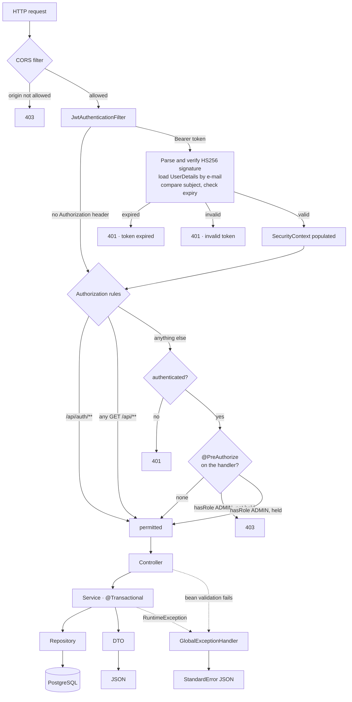

# Architecture

How the API is put together, and why it is shaped this way.

- [The shape of the project](#the-shape-of-the-project)
- [Layers](#layers)
- [Why DTOs exist at all](#why-dtos-exist-at-all)
- [Request lifecycle](#request-lifecycle)
- [Transaction boundaries](#transaction-boundaries)
- [Where the external world is touched](#where-the-external-world-is-touched)
- [What this architecture is not](#what-this-architecture-is-not)

---

## The shape of the project

Pesca Brasil is a **single Spring Boot application** — one deployable unit, one
database, one process. It is not a microservice estate and it does not pretend to be
one. There is no message broker, no eventual consistency, no service discovery. A
catch record is written in one transaction and it is either there or it is not.

That is a deliberate choice rather than a missing feature. The domain has one
aggregate that anybody writes to often — the catch record — and everything else is a
catalogue that changes rarely. Splitting rivers, fish and equipment into their own
services would multiply the operational cost without removing a single coupling, since
a catch record needs all of them to be consistent at the moment it is written.

The one thing the application does delegate is anything with a different failure
profile: image storage goes to Cloudinary, email goes to an SMTP provider, bot
detection goes to Google reCAPTCHA. Those are not services in our architecture; they
are dependencies whose outages we survive differently, and each is treated
accordingly.

---

## Layers

Four layers, and the boundaries are enforced by what each one is allowed to import.

```
HTTP ──► Controller ──► Service ──► Repository ──► PostgreSQL
            │              │
          DTO in         entity
          DTO out        enum
```

| Layer | Package | Responsibility | Never does |
|---|---|---|---|
| **Controller** | `controller` | Bind HTTP, build the `Pageable`, choose the status code | Business rules, entity access |
| **Service** | `service` | Rules, cross-entity validation, transactions, entity ⇄ DTO | Know what HTTP is |
| **Repository** | `repository` | Spring Data JPA queries and projections | Anything else |
| **Entity** | `entity` | The persistent model and its relationships | Leave the service layer |

The rule that gives this teeth: **an entity is never returned from a controller.** Every
response is a DTO built inside the service. This is not ceremony — three concrete
things depend on it:

1. `User` carries a BCrypt hash and a live verification code. Serialising the entity
   would publish both. `CatchRecordResponseDTO` exposes `userName` and nothing else,
   so the leak is not possible rather than merely not currently happening.
2. Every association on `CatchRecord` is `FetchType.LAZY`. Serialising the entity
   outside a transaction throws `LazyInitializationException`, and serialising it
   inside one silently issues a query per association. The DTO conversion reads
   exactly the fields it needs, in the transaction that already exists.
3. `Fish` points at baits and equipment, which is a cycle Jackson would follow. The
   response DTO simply does not contain it.

The same argument runs the other way for requests. `CatchRecordRequestDTO` carries
`fishId`, not a `Fish`, so no client can invent a species by posting a nested object.
Identifiers are resolved against the database by the service, and a wrong id becomes a
rejection rather than a phantom row.

---

## Why DTOs exist at all

Mapping is done by hand — a private `convertToResponseDTO` in each service — rather
than by MapStruct or ModelMapper. For eight small aggregates, a reflective mapper
costs a dependency, a build-time step and a class of bugs that only appear when a
field is renamed. The hand-written method fails to compile instead.

The cost is real and worth stating: the conversion is duplicated once per service, and
adding a field to a response means touching two files. That trade holds at this size
and stops holding somewhere north of twenty aggregates.

---

## Request lifecycle



Three details in that diagram are worth naming.

**The JWT filter runs on every request, including public ones.** It exits early when
there is no `Authorization` header, so an anonymous `GET /api/fishes` costs nothing.
When a token *is* present the filter loads the user from the database — see
[Security](04-security.md) for why that read is the point rather than an oversight.

**Authentication and authorization are separate questions.** The filter answers *who
is this*; the rules in `SecurityConfig` answer *may they*. A request with a perfectly
valid token for a disabled account gets past the first and fails the second, because
`CustomUserDetailsService` passes `user.isEnabled()` into the `UserDetails` it builds.

**Authorization is asked twice, at two different resolutions.** The filter chain decides
by URL and method, which is as specific as a matcher can be. `@PreAuthorize` on the
handler decides by role, which is the part a URL pattern cannot express — the catalogue
`POST` and the catch-record `POST` are both authenticated writes under `/api`, and only
one of them should require an administrator. Ownership is a third resolution again, and
it lives in the service, because only the service can load the row to compare against.

---

## Transaction boundaries

Every service class is annotated `@Transactional(readOnly = true)` and every mutating
method overrides it with a plain `@Transactional`. Reads therefore run in a read-only
transaction by default, which lets Hibernate skip dirty checking on the entities it
loads, and a method that forgets the override fails loudly at the first write instead
of quietly committing.

The boundary is the **service method**, never the controller and never the repository.
That matters most in `CatchRecordService.save`, which is the only place in the codebase
where two tables are written together:

```
POST /api/catch-records
  ├── resolve the logged-in user from the SecurityContext
  ├── resolve the fish            (404 if absent)
  ├── INSERT tb_fishing_spot      ← the map pin becomes a spot
  ├── resolve bait and equipment  (optional)
  └── INSERT catch_record         ← points at the spot just created
                                    one transaction, both rows or neither
```

If the catch record insert fails, the fishing spot it invented is rolled back with it.
Without the shared transaction the database would slowly fill with spots that no catch
record references — coordinates nobody dropped a pin on twice.

---

## Where the external world is touched

Three outbound integrations, each isolated in a single class, each with a different
answer to "what happens when it is down".

| Integration | Class | On failure |
|---|---|---|
| **Cloudinary** | `ImageUploadService` | `500` from `/api/images/upload`. The catch record is not blocked — `photoUrl` is optional, so the user can save without a photo |
| **SMTP** | `EmailService` | `@Async`, so registration still returns `200`. The account exists but no code arrives, and the user must use *forgot password* to get a fresh one |
| **reCAPTCHA** | `RecaptchaService` | Registration and login are refused. This is the correct direction: failing open would remove the only bot defence on the account endpoints |

`EmailService` being `@Async` is the interesting one. Sending mail synchronously inside
`registerUser` would put an SMTP round trip — five seconds of timeout, in the worst
case — inside a database transaction that has already inserted the user. Async moves
the send off the request thread and out of the transaction. The trade is that a send
failure is invisible to the caller, which is why the recovery path exists.

> **Note:** `@Async` is annotated but `@EnableAsync` is not currently present, so the
> method runs on the calling thread today. This is recorded in
> [Roadmap](06-roadmap.md) rather than hidden.

---

## What this architecture is not

Stated plainly so the absences do not read as accidents:

- **It is not hexagonal.** There are no ports and no adapters; the service layer
  imports Spring Data and Spring Security types directly. At this size the indirection
  would cost more attention than it saves.
- **There is no domain layer with behaviour.** Entities are data holders and the rules
  live in services — the anaemic model, chosen knowingly. The rules here are almost all
  *cross-entity* validation ("does this river exist"), which has nowhere natural to live
  inside a single entity anyway.
- **There is no caching layer.** The catalogue barely changes and would cache well, but
  nothing measured says the query is a problem yet.
- **There is no schema migration tool.** Hibernate's `ddl-auto=update` owns the schema.
  See [Data model](02-data-model.md) for what that costs.
