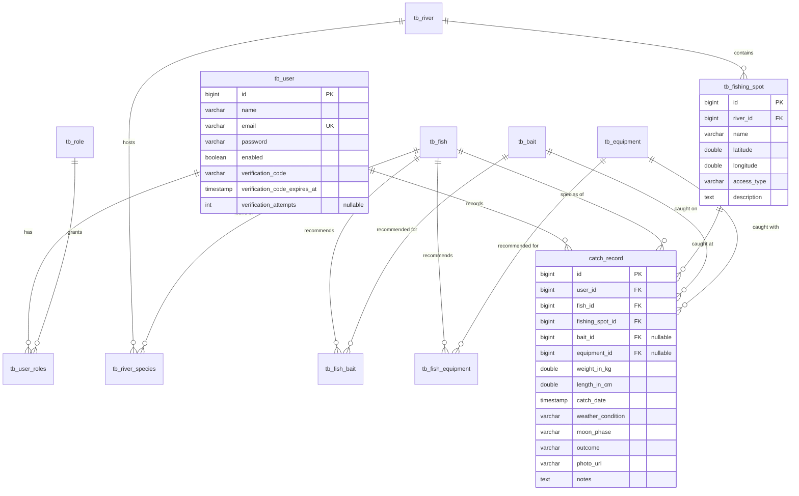

# Data model

Thirteen tables in one PostgreSQL database. What each one holds, how they relate, and
the modelling decisions that are easy to get wrong.

- [Diagram](#diagram)
- [Identity](#identity)
- [Catalogue](#catalogue)
- [Geography](#geography)
- [The logbook](#the-logbook)
- [Regulations](#regulations)
- [Naming, and one inconsistency](#naming-and-one-inconsistency)
- [Schema ownership](#schema-ownership)
- [Types and their reasons](#types-and-their-reasons)

---

## Diagram

---

## Identity

| Table | Purpose |
|---|---|
| `tb_user` | One row per fisher. E-mail is unique and is the login identifier |
| `tb_role` | Two rows, seeded at boot: `ROLE_ADMIN` and `ROLE_PESCADOR` |
| `tb_user_roles` | Many-to-many join. Every user registered through the API gets `ROLE_PESCADOR` |

`enabled` defaults to `true` on the field but is explicitly set to `false` by
`UserService.registerUser`. An account therefore exists before it can log in, and the
six-digit code in `verification_code` is what closes the gap. Both the code and its
expiry are nulled the moment they are consumed, so a used code cannot be replayed and
a verified row carries no live secret.

The same columns are reused for the password-reset flow. That is a deliberate economy —
the two flows are the same mechanism, *prove you read this e-mail* — and it has one
consequence worth knowing: requesting a password reset on an unverified account
overwrites the activation code with the reset code. The user gets a working path either
way, because the reset code is what the reset endpoint asks for.

`verification_attempts` counts the wrong guesses against the current code and is reset
whenever a code is issued or successfully used. The fifth wrong guess destroys the code
rather than merely rejecting the attempt: a six-digit code has a million values and
fifteen minutes of life, which is walkable if nothing counts.

**The column is nullable and the Java field is `Integer`, not `int`.** With
`ddl-auto=update` owning the schema, `ALTER TABLE ... ADD COLUMN ... NOT NULL` against a
table that already has rows fails on PostgreSQL — Hibernate logs the failure and carries
on booting, leaving the application reading a column that does not exist. A nullable
column is added successfully, and `null` is read as "no attempts recorded".

The roles table is filled by `RoleDataLoader`, a `CommandLineRunner` that checks
before inserting. It runs on every boot and is idempotent by construction, which is
what makes it safe against a shared database and multiple instances.

---

## Catalogue

Reference data. Rarely written, read on nearly every screen.

| Table | Columns that matter | Notes |
|---|---|---|
| `tb_fish` | `common_name`, `scientific_name`, `conservation_status`, `description`, `image_url` | Searchable by common name, case-insensitive |
| `tb_bait` | `name`, `type`, `description` | `type` is `ARTIFICIAL` or `NATURAL` |
| `tb_equipment` | `type`, `recommended_line_weight`, `action` | `type` is `MOLINETE` or `CARRETILHA` |
| `tb_fish_bait` | `fish_id`, `bait_id` | "Which baits work for this species" |
| `tb_fish_equipment` | `fish_id`, `equipment_id` | "Which rods suit this species" |

The two join tables are what turn a catalogue into advice. They are many-to-many in
both directions on purpose: a bait catches several species, and a species takes several
baits. Modelling either side as a single column would force a choice the domain does
not make.

Both are owned by `Fish` and populated by id — `FishRequestDTO` carries
`recommendedBaitIds` and `recommendedEquipmentIds`, and `FishService` resolves them with
`findAllById` before saving. Because `findAllById` returns only what it finds, the
service compares the resolved count against the requested one and refuses a missing id
with `404`; without that check an unknown id vanished silently and the caller got `201`
with fewer recommendations than it asked for.

`FishResponseDTO` returns both lists in full, so the relationship is readable as well as
writable. The cost is an N+1: each fish loads its two collections separately, and a page
of ten costs twenty extra queries. An `@EntityGraph` would fix the single-fish case, and
would force pagination in memory for the list — which is why the list is not fixed that
way. See [Roadmap item 7](06-roadmap.md#7--n1-on-the-fish-catalogue).

---

## Geography

| Table | Purpose |
|---|---|
| `tb_river` | Name, hydrographic basin, description |
| `tb_fishing_spot` | A point: `river_id`, `latitude`, `longitude`, name, access type |
| `tb_river_species` | Which species live in which river, with `abundance` and `best_season` |

`tb_river_species` is an association table carrying its own attributes, which is why it
is an entity rather than a bare `@ManyToMany`. "Dourado is `ALTA` abundance in the Rio
Paraná, best between September and November" is a fact about the *pairing*, and it has
nowhere to live on either side alone.

The interesting table is `tb_fishing_spot`, because rows land in it two different ways:

- **Registered deliberately** through `POST /api/fishing-spots`, with a name, an access
  type and a description. These are the curated spots.
- **Created as a side effect** of `POST /api/catch-records`, when the client sends a
  latitude and longitude instead of a `fishingSpotId`. The spot is named from
  `spotName`, or falls back to `"Ponto no " + river.getName()`, and its `access_type`
  is set to the literal `"Não especificado"`.

**The second path deduplicates before it inserts.** A coordinate on the same river
within roughly 55 m of an existing spot reuses that spot instead of creating another —
otherwise the table grew once per *catch* rather than once per *place*, and two fish
landed from the same rock produced two rows.

The match is a bounding box on latitude and longitude, not a radius. Computing true
distance in the database would need trigonometry to separate two points a few dozen
metres apart, and at that scale the difference between the box and the circle changes no
decision. `0.0005` degrees of latitude is about 55 m; in longitude the same value covers
less ground the further from the equator, by at most about 15% across Brazil, which does
not change which spot is picked.

Nothing else distinguishes the two paths afterwards. A spot born from a map pin is
indistinguishable from a curated one except by its placeholder access type — the honest
remaining cost of the decision described in the README.

---

## The logbook

`catch_record` is the only table anybody writes to often, and the only one that joins
five others.

| Column | Nullable | Why |
|---|---|---|
| `user_id` | no | Taken from the `SecurityContext`, never from the request body |
| `fish_id` | no | A catch without a species is not a record |
| `fishing_spot_id` | no | Either resolved or created — see above |
| `bait_id` | **yes** | People fish without remembering, or without a bait |
| `equipment_id` | **yes** | Same |
| `catch_date` | no | Supplied by the client, so a trip can be logged afterwards |
| `weight_in_kg`, `length_in_cm` | yes | Either one alone is a valid record; the rankings skip nulls |
| `weather_condition`, `moon_phase`, `outcome` | yes | Enums, stored as strings |
| `photo_url` | yes | A Cloudinary URL, uploaded separately before the record is posted |
| `notes` | yes | `TEXT` |

The nullability is the model's opinion about the domain: **the only things required are
what was caught, where, by whom and when.** Everything else is a detail the fisher may
or may not have written down, and a schema that demanded all of it would produce either
lies or abandoned forms.

`weight_in_kg` and `length_in_cm` being independently optional is what makes the two
leaderboards separate queries — `findTop10ByLengthInCmIsNotNullOrderByLengthInCmDesc`
and its weight twin both filter nulls in the derived query name, so a record measured
only by length still competes for the length record.

The three enums are `@Enumerated(EnumType.STRING)`. Ordinal storage would write `0`,
`1`, `2` and silently reinterpret every historical row the moment somebody inserts a
value in the middle of the enum. The string costs a few bytes and cannot do that.

---

## Regulations

`tb_fishing_regulation` holds closed seasons — *piracema*, the annual spawning ban —
as `hydrographic_basin`, `start_date`, `end_date` and free-text `notes`.

The basin is a **string, not a foreign key to `tb_river`**, and that is intentional:
the ban is published by basin, and a basin contains many rivers. Pointing at a river
would force the same regulation to be duplicated per river and would go stale the
moment a river was added.

The cost is that `tb_river.hydrographic_basin` and
`tb_fishing_regulation.hydrographic_basin` are two free-text columns that must agree
by convention rather than by constraint. Promoting the basin to its own table is the
correct fix and is on the roadmap; the current search is a case-insensitive `LIKE`,
which tolerates the drift rather than resolving it.

---

## Naming, and one inconsistency

Every entity declares `@Table(name = "tb_...")` — except `CatchRecord`, which declares
no `@Table` at all and therefore lands on Hibernate's default,
`catch_record`. Twelve tables carry the prefix and one does not.

It is recorded here rather than quietly fixed because fixing it is not free: with
`ddl-auto=update` owning the schema, adding `@Table(name = "tb_catch_record")` creates
an empty new table beside the populated old one and leaves every existing record
invisible. The rename needs a migration, which needs a migration tool — see below.

---

## Schema ownership

`spring.jpa.hibernate.ddl-auto=update`. Hibernate compares the entity model to the
live schema at boot and issues the DDL it thinks is missing.

This is what makes the project fast to change, and it is the single biggest structural
risk in the codebase. Stated exactly:

- **`update` never drops and never alters.** Removing a field leaves the column;
  narrowing a type is ignored. The schema only accumulates.
- **There is no record of what ran.** Two environments that received the entities in a
  different order can end up structurally different with nothing to compare.
- **A rename is a create.** The old column stays, full of the data, and the new one is
  born empty.
- **The application boots with permission to change production's schema**, which is a
  privilege it does not otherwise need.

Flyway is the intended replacement: baseline the current schema, then own every change
as a numbered script and switch `ddl-auto` to `validate` so a mismatch fails the boot
instead of silently reshaping the database. It is the first item on the
[roadmap](06-roadmap.md).

---

## Types and their reasons

| Concern | Choice | Reason |
|---|---|---|
| Primary keys | `bigint`, `GenerationType.IDENTITY` | Postgres `IDENTITY`; sequential and cheap to index |
| Coordinates | `double` | Correct at the precision a phone's GPS actually reports |
| Weight and length | `Double` (nullable) | Measurements, not money — floating point is appropriate here |
| Enums | `EnumType.STRING` | Ordinals break on reordering |
| Long text | `columnDefinition = "TEXT"` | Descriptions and notes have no natural bound |
| Timestamps | `LocalDateTime` | See the caveat below |
| Password | `varchar(255)` | BCrypt output is 60 characters; the width leaves room for a future stronger encoder |

**On `LocalDateTime`:** `catch_date` has no time zone. Brazil currently observes a
single offset for most of the country, so today this is invisible. It is still a
latent bug — a record logged from a different zone stores the wall clock rather than
the instant — and `OffsetDateTime` is the correct type. It is on the roadmap.

**On equality:** every entity uses `@EqualsAndHashCode(onlyExplicitlyIncluded = true)`
with only the id included. Lombok's default would include every field, which for an
entity means the hash code of an object in a `Set` changes when a field is edited, and
lazy associations get loaded just to compare. Id-only equality avoids both.
`CatchRecord` is the exception — it declares no equality at all and uses Java's
identity default, which is safe but inconsistent with its twelve neighbours.
