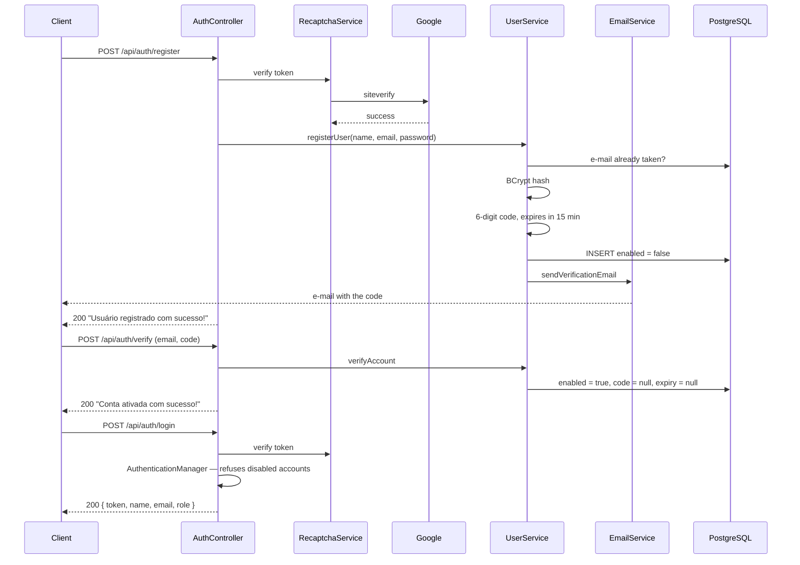

# Security

Authentication is written from scratch here — no Firebase, no Auth0, no OAuth provider.
This document says how it works, what it deliberately does not do, and where the gaps
are.

- [Why a homegrown identity](#why-a-homegrown-identity)
- [The registration handshake](#the-registration-handshake)
- [Passwords](#passwords)
- [The token](#the-token)
- [Why the filter reads the database](#why-the-filter-reads-the-database)
- [The authorization model](#the-authorization-model)
- [reCAPTCHA](#recaptcha)
- [CORS](#cors)
- [Secrets](#secrets)
- [Known gaps](#known-gaps)

---

## Why a homegrown identity

Delegating identity is usually the right answer, and it is the answer the sibling
project [TicketFlow](https://github.com/patrickpriebe/ticketflow) gives — its services
validate Google's tokens and issue none of their own.

This project goes the other way on purpose. The audience is Brazilian recreational
fishers, a good share of whom do not want a Google account attached to a hobby app, and
the product needs exactly one thing from identity: *this e-mail address belongs to the
person using it.* An e-mail round trip proves that directly. Everything a provider adds
beyond that — federated profiles, refresh flows, consent screens — is surface this
product would carry without using.

The cost is that every mistake below is ours to make, which is the reason this document
exists rather than a link to a provider's.

---

## The registration handshake



Three properties of this flow are load-bearing:

**The account exists before it is usable.** `enabled` is set to `false` on insert, and
`CustomUserDetailsService` passes that flag into the `UserDetails` it builds, so Spring
Security's `DaoAuthenticationProvider` refuses the login on its own. The check is not
an `if` somebody can forget to write — it is a field the framework already respects.

**The code is destroyed when used.** Both `verification_code` and
`verification_code_expires_at` are nulled on successful verification and on successful
reset. A verified row holds no live secret, so a database read cannot yield a working
credential.

**Expiry is checked before correctness.** `verifyAccount` tests the timestamp first and
the code second. An expired code is refused as expired regardless of whether it was
right, which is the correct order — the alternative tells an attacker with an old code
that the code was at least valid.

---

## Passwords

BCrypt, through Spring Security's `BCryptPasswordEncoder` at its default strength of
10. The salt is generated per password and stored inside the hash, so identical
passwords produce different rows and a stolen table cannot be attacked with a single
rainbow table.

The raw password exists in exactly two places in the codebase — the request DTO and
the argument to `encode` — and is never logged, never stored and never returned.

**There is no password policy.** Nothing checks length, composition or whether the
password appears in a breach corpus. That is a real gap, listed below.

---

## The token

HMAC-SHA256, signed with a symmetric key, valid for **24 hours**.

```
{ "sub": "fisher@example.com", "iat": ..., "exp": ... }
```

Three claims and nothing else. In particular **the token does not carry roles.** That
is the single most consequential decision in the auth design, and it is examined in the
next section.

The subject is the e-mail address rather than the numeric id. That is a defensible
choice — the e-mail is unique and is what the user types — with one consequence: the
system cannot support changing an e-mail address without invalidating tokens, because
the identity in the token would no longer resolve. There is no e-mail-change endpoint
today, so the constraint is currently free.

**A token cannot be revoked.** There is no denylist, no `jti`, no server-side session.
Logging out means the client discards the token; the token itself stays valid until it
expires. Twenty-four hours is the entire blast radius of a leaked token, and that is
the number to argue about — not the mechanism.

The key comes from `jwt.secret`. `Keys.hmacShaKeyFor` refuses a key shorter than 256
bits, so a too-short secret fails at the first token rather than producing a weak
signature.

---

## Why the filter reads the database

`JwtAuthenticationFilter` does not trust the token alone. For every authenticated
request it:

1. Parses and verifies the signature.
2. Reads the subject.
3. **Loads that user from PostgreSQL** through `CustomUserDetailsService`.
4. Confirms the token's subject matches the loaded user, and that the token has not
   expired.

Step 3 is a database read on every authenticated request, and it is the deliberate
counterweight to a token that cannot be revoked. Because roles and the `enabled` flag
are read fresh each time rather than copied into the token at login:

- Disabling an account takes effect on the **next request**, not in up to 24 hours.
- Changing a user's roles takes effect immediately.
- Deleting a user makes every token they hold stop working at once.

A token carrying its own roles would be faster and would make all three of those
statements false. This is the trade the design makes on purpose: one indexed read per
request, bought against a stale-authorization window that would otherwise be a full
day wide.

The filter distinguishes its failures. An `ExpiredJwtException` answers `401` with
*"Token expirado. Por favor, faça login novamente."*, which is what the frontend needs
to know it should send the user back to the login screen rather than show an error.
Anything else answers `401` with *"Token inválido."*

---

## The authorization model

Four rules, in order, from `SecurityConfig`:

| # | Matcher | Effect |
|---|---|---|
| 1 | `/api/auth/**` | Public — registration and login cannot require a token |
| 2 | `/api/images/**` | Public |
| 3 | `GET /api/**` | Public |
| 4 | everything else | Authenticated |

Rule 3 is the product decision, stated as configuration: **the catalogue and the
logbook are public.** Anyone can read the fish, the rivers, the closed seasons, the
leaderboards and every catch record without an account. That is what the product is —
a public record of Brazilian sport fishing — and requiring a login to browse it would
cost the audience it is meant to reach. Catch records carry the fisher's display name
and nothing else precisely because they are public.

Sessions are `STATELESS` and CSRF is disabled, which is the correct pairing: with no
session cookie there is no ambient credential for a cross-site request to ride on, and
the bearer token must be attached explicitly by JavaScript that the attacker's page
cannot run against our origin.

### Roles exist but are not enforced

`ROLE_ADMIN` and `ROLE_PESCADOR` are seeded at boot, attached to users, loaded into the
`SecurityContext` as authorities, and returned to the client on login — which uses them
to decide what to render.

They are **not checked anywhere on the server.** There is no `@PreAuthorize`, no
`@Secured`, no `hasRole(...)` in the filter chain; the only distinction the API makes
is authenticated versus not. Every write endpoint therefore accepts any verified
fisher, and the admin distinction currently lives entirely in the frontend, which is to
say it lives nowhere enforceable.

Closing this is the top security item on the [roadmap](06-roadmap.md), and it is
mechanical: enable method security and require `ROLE_ADMIN` on catalogue writes, and
require ownership on catch-record deletion. It is written down here rather than left
implicit because an authorization gap that nobody has named is one nobody fixes.

### Ownership is enforced on write and not on delete

`POST /api/catch-records` takes the owner from the `SecurityContext` — the request body
has no user field, so a client cannot post a record as somebody else. That is the right
pattern, and it is worth stating as a rule: **identity is derived from the token, never
read from the payload.**

`DELETE /api/catch-records/{id}` does not apply the same rule. It checks that the
caller is authenticated and deletes by id. Same roadmap item.

### The image endpoint is open

`/api/images/**` is `permitAll`, so `POST /api/images/upload` accepts a file with no
token. There is no declared size limit, no content-type allowlist and no rate limit, and
every accepted file is stored in Cloudinary under the project's account.

It is public because the upload happens on the registration-adjacent part of the client
flow and requiring a token there was inconvenient. That is a reason, not a
justification; requiring authentication and adding a size and type limit is on the
roadmap.

---

## reCAPTCHA

`RecaptchaService` posts the client's token to Google's `siteverify` and rejects
anything that does not come back `success: true`. It is wired into **register** and
**login**.

Two properties:

- **It fails closed.** Any exception — a network failure, a malformed response, a
  missing secret — becomes a `RuntimeException` and the request is refused. Failing
  open would silently remove the only bot defence on the account endpoints, and a
  registration form is exactly where that matters.
- **It runs before anything else.** The captcha check is the first statement in both
  handlers, so a bot never reaches the password comparison and never learns anything
  about which e-mails exist.

`forgot-password` has **no captcha**, which makes it the cheapest endpoint to automate
against. Listed below.

---

## CORS

Two origins are allowed, with credentials:

```java
List.of("http://localhost:4200", "https://pescabrasil.vercel.app")
```

An explicit list rather than a wildcard, which is required anyway once
`allowCredentials` is true — the browser refuses `*` with credentials, so this is the
framework declining to let the configuration be wrong.

> **The deployed frontend is at `https://pesca-brasil-ui.vercel.app`, which is not on
> this list.** The two names differ by two hyphens. Any deployment served from the
> hyphenated host is refused by the browser before the request is sent. This is worth
> checking against the Vercel project's current domains before it is treated as
> correct.

---

## Secrets

Nothing sensitive is committed. `application.properties` holds only the shape:

```properties
spring.datasource.url=${DB_URL:}
cloudinary.api-secret=${CLOUDINARY_API_SECRET:}
google.recaptcha.secret=${RECAPTCHA_SECRET:}
jwt.secret=${JWT_SECRET:ChaveTemporaria...}
```

Real values live in Render's environment panel in the deployed environment, and in
`application-local.properties` for local development — a file that is listed in
`.gitignore` as `**/application-local.properties` and has never appeared in the git
history.

Two things about that block deserve naming:

**The credentials default to empty, and that is right.** A missing `DB_URL` fails the
boot rather than connecting to something unintended. A default would be worse than an
absence.

**`jwt.secret` has a fallback, and that is wrong.** It is there so a fresh clone starts
without configuration, but the consequence is that an environment which forgets to set
`JWT_SECRET` boots successfully and signs tokens with a value that is in this
repository — meaning anybody could mint a valid token for any e-mail address. A secret
should have no default at all, for the same reason the database URL has none. Removing
the fallback is on the roadmap.

---

## Known gaps

Recorded so they read as known rather than as oversights. Ordered by how much they
matter.

| Gap | Consequence |
|---|---|
| **Roles are never checked server-side** | Any verified account can write to the catalogue; `ROLE_ADMIN` is decorative |
| **No ownership check on catch-record deletion** | Deletion is authenticated but not authorised |
| **`jwt.secret` has a committed default** | An environment missing the variable signs with a public key |
| **Image upload is unauthenticated and unbounded** | Anonymous writes to the project's Cloudinary account |
| **Nothing is rate limited** | Login, registration and password reset can be automated against freely |
| **`forgot-password` has no captcha, and confirms whether an account exists** | E-mail enumeration, cheaply |
| **OTP uses `java.util.Random`** | A predictable PRNG where `SecureRandom` belongs. `nextInt(999999)` also never produces `999999` |
| **No password policy** | A one-character password is accepted |
| **`e.printStackTrace()` in the JWT filter** | Stack traces to stdout instead of the logger |
| **Tokens cannot be revoked** | A leaked token is valid for up to 24 hours |
| **No security headers** | No CSP, HSTS or `X-Content-Type-Options` on API responses |

Each of these has a corresponding entry in the [roadmap](06-roadmap.md).
