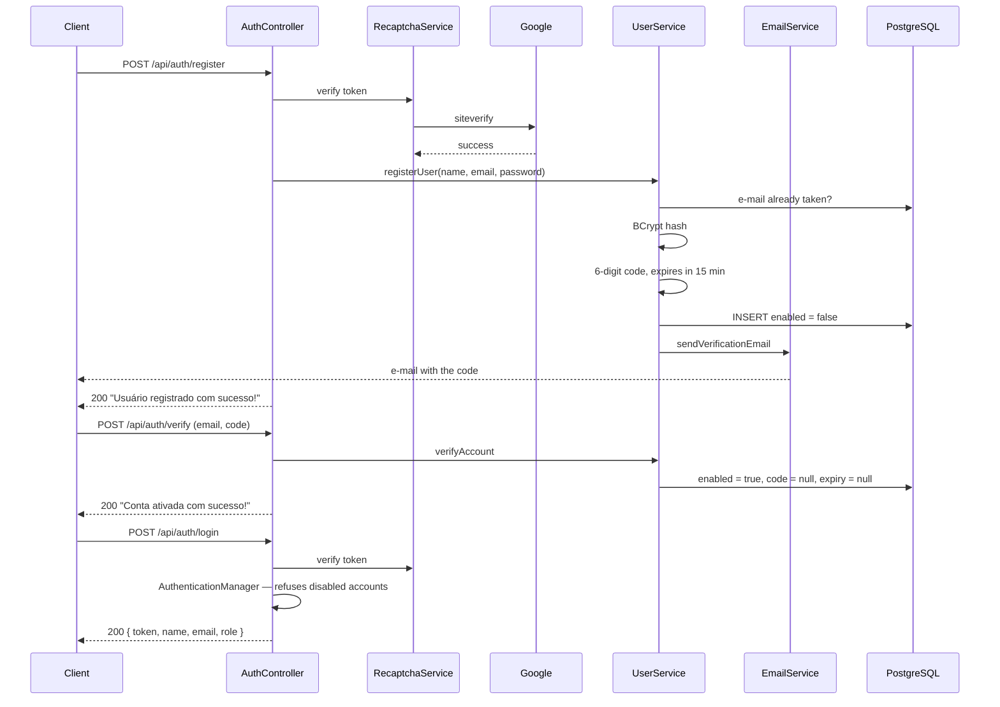

# Security

Authentication is written from scratch here — no Firebase, no Auth0, no OAuth provider.
This document says how it works, what it deliberately does not do, and where the gaps
are.

- [Why a homegrown identity](#why-a-homegrown-identity)
- [The registration handshake](#the-registration-handshake)
- [Passwords](#passwords)
- [The token](#the-token)
- [Why the filter reads the database](#why-the-filter-reads-the-database)
- [The authorization model](#the-authorization-model)
- [reCAPTCHA](#recaptcha)
- [The reset flow does not confirm who exists](#the-reset-flow-does-not-confirm-who-exists)
- [CORS](#cors)
- [Secrets](#secrets)
- [Known gaps](#known-gaps)

---

## Why a homegrown identity

Delegating identity is usually the right answer, and it is the answer the sibling
project [TicketFlow](https://github.com/patrickpriebe/ticketflow) gives — its services
validate Google's tokens and issue none of their own.

This project goes the other way on purpose. The audience is Brazilian recreational
fishers, a good share of whom do not want a Google account attached to a hobby app, and
the product needs exactly one thing from identity: *this e-mail address belongs to the
person using it.* An e-mail round trip proves that directly. Everything a provider adds
beyond that — federated profiles, refresh flows, consent screens — is surface this
product would carry without using.

The cost is that every mistake below is ours to make, which is the reason this document
exists rather than a link to a provider's.

---

## The registration handshake



Three properties of this flow are load-bearing:

**The account exists before it is usable.** `enabled` is set to `false` on insert, and
`CustomUserDetailsService` passes that flag into the `UserDetails` it builds, so Spring
Security's `DaoAuthenticationProvider` refuses the login on its own. The check is not
an `if` somebody can forget to write — it is a field the framework already respects.

**The code is destroyed when used.** Both `verification_code` and
`verification_code_expires_at` are nulled on successful verification and on successful
reset. A verified row holds no live secret, so a database read cannot yield a working
credential.

**Expiry is checked before correctness.** `verifyAccount` tests the timestamp first and
the code second. An expired code is refused as expired regardless of whether it was
right, which is the correct order — the alternative tells an attacker with an old code
that the code was at least valid.

---

## Passwords

BCrypt, through Spring Security's `BCryptPasswordEncoder` at its default strength of
10. The salt is generated per password and stored inside the hash, so identical
passwords produce different rows and a stolen table cannot be attacked with a single
rainbow table.

The raw password exists in exactly two places in the codebase — the request DTO and
the argument to `encode` — and is never logged, never stored and never returned.

**There is no password policy.** Nothing checks length, composition or whether the
password appears in a breach corpus. That is a real gap, listed below.

---

## The token

HMAC-SHA256, signed with a symmetric key, valid for **24 hours**.

```
{ "sub": "fisher@example.com", "iat": ..., "exp": ... }
```

Three claims and nothing else. In particular **the token does not carry roles.** That
is the single most consequential decision in the auth design, and it is examined in the
next section.

The subject is the e-mail address rather than the numeric id. That is a defensible
choice — the e-mail is unique and is what the user types — with one consequence: the
system cannot support changing an e-mail address without invalidating tokens, because
the identity in the token would no longer resolve. There is no e-mail-change endpoint
today, so the constraint is currently free.

**A token cannot be revoked.** There is no denylist, no `jti`, no server-side session.
Logging out means the client discards the token; the token itself stays valid until it
expires. Twenty-four hours is the entire blast radius of a leaked token, and that is
the number to argue about — not the mechanism.

The key comes from `jwt.secret`. `Keys.hmacShaKeyFor` refuses a key shorter than 256
bits, so a too-short secret fails at the first token rather than producing a weak
signature.

---

## Why the filter reads the database

`JwtAuthenticationFilter` does not trust the token alone. For every authenticated
request it:

1. Parses and verifies the signature.
2. Reads the subject.
3. **Loads that user from PostgreSQL** through `CustomUserDetailsService`.
4. Confirms the token's subject matches the loaded user, and that the token has not
   expired.

Step 3 is a database read on every authenticated request, and it is the deliberate
counterweight to a token that cannot be revoked. Because roles and the `enabled` flag
are read fresh each time rather than copied into the token at login:

- Disabling an account takes effect on the **next request**, not in up to 24 hours.
- Changing a user's roles takes effect immediately.
- Deleting a user makes every token they hold stop working at once.

A token carrying its own roles would be faster and would make all three of those
statements false. This is the trade the design makes on purpose: one indexed read per
request, bought against a stale-authorization window that would otherwise be a full
day wide.

The filter distinguishes its failures. An `ExpiredJwtException` answers `401` with
*"Token expirado. Por favor, faça login novamente."*, which is what the frontend needs
to know it should send the user back to the login screen rather than show an error.
Anything else answers `401` with *"Token inválido."*

---

## The authorization model

Three rules in the filter chain, from `SecurityConfig`:

| # | Matcher | Effect |
|---|---|---|
| 1 | `/api/auth/**` | Public — registration and login cannot require a token |
| 2 | `GET /api/**` | Public |
| 3 | everything else | Authenticated |

and `@EnableMethodSecurity` on top of them, so individual handlers can ask for more.

Rule 2 is the product decision, stated as configuration: **the catalogue and the
logbook are public.** Anyone can read the fish, the rivers, the closed seasons, the
leaderboards and every catch record without an account. That is what the product is —
a public record of Brazilian sport fishing — and requiring a login to browse it would
cost the audience it is meant to reach. Catch records carry the fisher's display name
and nothing else precisely because they are public.

Sessions are `STATELESS` and CSRF is disabled, which is the correct pairing: with no
session cookie there is no ambient credential for a cross-site request to ride on, and
the bearer token must be attached explicitly by JavaScript that the attacker's page
cannot run against our origin.

### Two kinds of write, two different bars

Being authenticated is not one permission. The API distinguishes three levels, because
the blast radius of the three operations is not the same:

| Operation | Requires | Reason |
|---|---|---|
| Read anything | nothing | The product is a public record |
| `POST /api/catch-records` | a valid token | Logging a catch is what a fisher does |
| `DELETE /api/catch-records/{id}` | token **and** ownership | It is their record, not anyone's |
| Every catalogue write | token **and** `ROLE_ADMIN` | It changes what everybody sees |

Catalogue writes are the `POST` and `DELETE` handlers on fish, baits, equipment,
rivers, river species, fishing spots and regulations — fourteen handlers, each carrying
`@PreAuthorize("hasRole('ADMIN')")`, enabled by `@EnableMethodSecurity` on
`SecurityConfig`. `hasRole('ADMIN')` matches the authority `ROLE_ADMIN`, which is
exactly what `CustomUserDetailsService` builds from `RoleName`.

**No endpoint grants `ROLE_ADMIN`.** Registration always assigns `ROLE_PESCADOR`, and
promoting an account is a deliberate database operation:

```sql
INSERT INTO tb_user_roles (user_id, role_id)
SELECT u.id, r.id FROM tb_user u, tb_role r
WHERE u.email = 'you@example.com' AND r.name = 'ROLE_ADMIN';
```

That is on purpose. A registration endpoint able to hand out the role that guards the
catalogue would not be guarding it.

### Identity is derived from the token, never read from the payload

`POST /api/catch-records` takes the owner from the `SecurityContext`, and
`CatchRecordRequestDTO` has no user field at all — so a client cannot post a record as
somebody else, not because a check rejects the attempt but because there is nowhere to
put the lie.

`DELETE /api/catch-records/{id}` applies the same identity to the other direction: it
loads the record, compares its owner's e-mail against the authenticated principal, and
lets `ROLE_ADMIN` through as the exception.

**Not-yours and not-found answer the same.** Both throw the identical
*"Registro de captura não encontrado."*, which the handler turns into a `404`. A
distinct `403` would confirm to whoever is walking the id space that the record exists,
and the mere existence of somebody's catch record is already their information.

### The image endpoint

`POST /api/images/upload` requires a token. It falls through the filter chain to
`anyRequest().authenticated()` — there is no `permitAll` for `/api/images/**`, and the
frontend's HTTP interceptor already attaches the bearer token to every call, so nothing
on the client side had to change.

Two limits sit on top of that:

- **5 MB**, through `spring.servlet.multipart.max-file-size` and `max-request-size`.
  Declared in configuration rather than checked in code, so the request is rejected
  before the bytes are buffered.
- **Images only.** The handler refuses any `Content-Type` that does not start with
  `image/`, and refuses an empty file.

The content-type check is a client-declared header and therefore not proof of anything;
it is there so the endpoint does not become general-purpose file storage by accident.
Verifying the actual bytes is Cloudinary's job, and it does it.

---

## reCAPTCHA

`RecaptchaService` posts the client's token to Google's `siteverify` and rejects
anything that does not come back `success: true`. It is wired into **register**,
**login** and **forgot-password**.

Two properties:

- **It fails closed.** Any exception — a network failure, a malformed response, a
  missing secret — becomes a `RuntimeException` and the request is refused. Failing
  open would silently remove the only bot defence on the account endpoints, and a
  registration form is exactly where that matters.
- **It runs before anything else.** The captcha check is the first statement in all
  three handlers, so a bot never reaches the password comparison and never learns
  anything about which e-mails exist.

`ForgotPasswordRequestDTO` therefore carries a `recaptchaToken` alongside the e-mail.

---

## The reset flow does not confirm who exists

Three changes make `forgot-password` and `reset-password` say nothing about whether an
account is registered:

**`generatePasswordResetToken` no longer throws when the e-mail is unknown.** It looks
the user up with `ifPresent` and does nothing when there is no match. The controller
answers *"Se existir uma conta com este e-mail, enviamos um código de recuperação."*
either way, so the only signal that an address is registered is the message that
arrives in that inbox.

**`resetPassword` returns one message for three different failures** — unknown e-mail,
wrong code, expired code — all *"Código de segurança inválido ou expirado. Solicite um
novo."* Separate messages would put the membership check back one endpoint further
along.

**The code comes from `SecureRandom`.** It is a six-digit credential with a
fifteen-minute life, and `java.util.Random` is a linear congruential generator whose
future output is derivable from a short run of past output. The range is
`nextInt(1_000_000)`, which reaches `999999`; `nextInt(999999)` never does.

What is still missing is an attempt counter. A six-digit code has a million values and
fifteen minutes of life, and nothing currently limits how many guesses arrive in that
window — see [Known gaps](#known-gaps).

---

## CORS

Two origins are allowed, with credentials:

```java
List.of("http://localhost:4200", "https://pescabrasil.vercel.app")
```

An explicit list rather than a wildcard, which is required anyway once
`allowCredentials` is true — the browser refuses `*` with credentials, so this is the
framework declining to let the configuration be wrong.

The second entry is the deployed frontend, `https://pescabrasil.vercel.app`. The first
is Angular's development server. Nothing else is accepted, so a Vercel preview
deployment — which gets its own generated hostname — is refused by the browser before
the request is sent. That is the correct default; adding preview origins means either
listing them one by one or matching a pattern, and a pattern that is too loose is how a
CORS allowlist stops being one.

---

## Secrets

Nothing sensitive is committed. `application.properties` holds only the shape:

```properties
spring.datasource.url=${DB_URL:}
cloudinary.api-secret=${CLOUDINARY_API_SECRET:}
google.recaptcha.secret=${RECAPTCHA_SECRET:}
jwt.secret=${JWT_SECRET}
```

Real values live in Render's environment panel in the deployed environment, and in
`application-local.properties` for local development — a file that is listed in
`.gitignore` as `**/application-local.properties` and has never appeared in the git
history.

Two things about that block deserve naming:

**The credentials default to empty, and that is right.** A missing `DB_URL` fails the
boot rather than connecting to something unintended. A default would be worse than an
absence.

**`jwt.secret` has no default at all**, which is stricter still. `${JWT_SECRET}` with no
`:` means Spring cannot resolve the placeholder when the variable is absent, and the
context fails to start. The earlier version carried a literal fallback so a fresh clone
would boot — and the cost of that convenience was that an environment which forgot the
variable also booted, signing tokens with a string published in this repository.
Anybody reading the repo could then mint a valid token for any e-mail address.

`JwtUtil` adds a second check at construction time: a secret shorter than 32 characters
throws `IllegalStateException` with a message naming the property. HS256 needs a
256-bit key, and without the check the failure surfaces as a `WeakKeyException` at the
first login attempt — at runtime, in a code path nobody is watching, saying nothing
about which variable is wrong.

---

## Known gaps

Recorded so they read as known rather than as oversights. Ordered by how much they
matter.

| Gap | Consequence |
|---|---|
| **Nothing is rate limited** | Login, registration and password reset can be automated against freely; the six-digit reset code has no attempt counter |
| **No password policy** | A one-character password is accepted |
| **Tokens cannot be revoked** | A leaked token is valid for up to 24 hours. The per-request database read is what stops a *disabled* account from surviving that window |
| **`e.printStackTrace()` in the JWT filter** | Stack traces to stdout instead of the logger |
| **No security headers** | No CSP, HSTS or `X-Content-Type-Options` on API responses |

Each of these has a corresponding entry in the [roadmap](06-roadmap.md).

Rate limiting is the one that has not simply been deferred for time. The right layer is
the edge — Render's own controls, or a gateway — rather than a counter inside a service,
and an in-process limiter sitting behind Render's proxy would see one source address
for all traffic unless `X-Forwarded-For` is parsed correctly. Get that wrong and the
limiter throttles every user as though they were a single client, which is a worse
failure than the gap it closes. The decision is still open.

### Closed since this document was first written

Kept here so the history is legible rather than erased.

| Was | Now |
|---|---|
| Roles never checked server-side | `@EnableMethodSecurity`, and `hasRole('ADMIN')` on all fourteen catalogue write handlers |
| Catch-record deletion authenticated but not owned | Owner compared against the principal; `ROLE_ADMIN` excepted; not-yours answers as not-found |
| `jwt.secret` carried a committed fallback | No default, plus a 32-character minimum enforced at construction |
| Image upload unauthenticated and unbounded | Token required, 5 MB cap, `image/*` only, empty file refused |
| `forgot-password` had no captcha and confirmed account existence | Captcha added; identical response either way; `reset-password` collapsed to one failure message |
| OTP from `java.util.Random`, range missing a value | `SecureRandom`, `nextInt(1_000_000)` |
